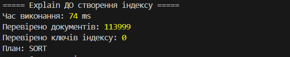
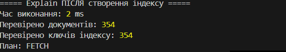
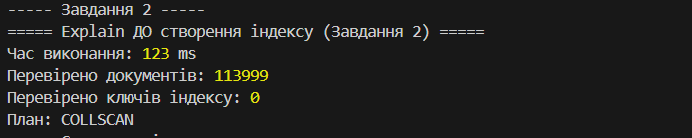
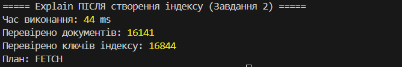

# MongoDB Analytics Platform for Music Streaming Service

## 1. Налаштування оточення

### Опис проєкту

У межах завдання було створено аналітичну платформу для музичного стримінгового сервісу на основі MongoDB.

Метою роботи було:

- завантажити початковий CSV-дataset у MongoDB Atlas;
- створити документоорієнтовану схему даних;
- виконати трансформацію даних за допомогою Aggregation Pipeline;
- реалізувати аналітичні запити;
- провести аналіз продуктивності запитів за допомогою індексів.


### Використані технології

У проєкті використовуються:

- MongoDB Atlas — хмарна база даних;
- MongoDB Shell (mongosh) — виконання MongoDB-запитів та JS-скриптів;
- Python — завантаження та підготовка даних;
- PyMongo — підключення Python до MongoDB;
- Pandas — обробка CSV-файлу.


## Структура проєкту

```
Poliakh_nosql_1
│
├── .env
├── .gitignore
├── requirements.txt
│
├── scripts/
│   ├── 01_load_data.py
│   └── 02_transform.js
│
├── queries/
│   ├── part2_queries.js
│   ├── part3_aggregations.js
│   └── part4_indexes.js
│
└── README.md
```


## Встановлення залежностей

Було створено віртуальне оточення:

```bash
python -m venv .venv
```

Активація оточення:

```bash
.venv\Scripts\activate
```


Встановлення необхідних бібліотек:

```bash
pip install -r requirements.txt
```


## Налаштування файлу .env

У корені проєкту створено файл `.env`.

Приклад:

```env
MONGO_URI=your_mongodb_atlas_connection_string
DB_NAME=spotify
```


## Порядок запуску

### 1. Завантаження даних

Перший етап — завантаження CSV-файлу у MongoDB.

Запуск:

```bash
python scripts/01_load_data.py
```

Після виконання створюється колекція:

```
spotify.tracks_raw
```


### 2. Трансформація даних

На цьому етапі плоска структура CSV перетворюється у документоорієнтовану схему.

Запуск:

```bash
mongosh "MONGO_URI" --file scripts/02_transform.js
```

Після виконання створюється колекція:

```
spotify.tracks
```


### 3. Запити частини 2

Виконання базових аналітичних запитів:

```bash
mongosh "MONGO_URI" --file queries/part2_queries.js
```


### 4. Aggregation Pipeline (частина 3)

Виконання аналітичних пайплайнів:

```bash
mongosh "MONGO_URI" --file queries/part3_aggregations.js
```


### 5. Аналіз індексів (частина 4)

Перевірка продуктивності запитів:

```bash
mongosh "MONGO_URI" --file queries/part4_indexes.js
```


# 2. Схема даних колекції tracks

Початковий dataset мав плоску структуру CSV. Після трансформації дані були переведені у документоорієнтований формат MongoDB.

Основні зміни:

- поле `artists` було перетворено з рядка у масив;
- аудіохарактеристики були об'єднані у вкладений об'єкт `audio_features`;
- додано поле `duration_sec` з тривалістю треку у секундах;
- створено поле `popularity_tier` для категоризації популярності;
- непотрібні вихідні поля були видалені.


Приклад документа колекції `tracks`:

```json
{
  "track_id": "5SuOikwiRyPMVoIQDJUgSV",
  "album_name": "Comedy",
  "track_name": "Comedy",
  "popularity": 73,
  "explicit": false,
  "track_genre": "acoustic",

  "artists": [
    "Gen Hoshino"
  ],

  "audio_features": {
    "danceability": 0.676,
    "energy": 0.461,
    "loudness": -6.746,
    "speechiness": 0.143,
    "acousticness": 0.0322,
    "instrumentalness": 0.00000101,
    "liveness": 0.358,
    "valence": 0.715,
    "tempo": 87.917,
    "key": 1,
    "mode": 0,
    "time_signature": 4
  },

  "duration_sec": 230.7,

  "popularity_tier": "high"
}
```


# 3. Теоретичні питання (частини 1–3)
## 1. Для чого використовується оператор $unwind?

Оператор $unwind використовується для роботи з полями, які містять масиви. Він розділяє елементи масиву на окремі документи, щоб кожен елемент можна було аналізувати окремо.

У нашій схемі поле artists зберігається у вигляді масиву, оскільки один трек може мати декількох виконавців. За допомогою $unwind кожен виконавець розглядається окремо, що дозволяє виконувати подальші операції, наприклад групування через $group та розрахунок статистики по кожному артисту.


## 2. Чим $stdDevPop відрізняється від $stdDevSamp?

Обидва оператори використовуються для обчислення стандартного відхилення, але вони застосовуються для різних типів даних.

$stdDevPop використовується, коли аналізуються всі дані певної групи. Він показує, наскільки значення відхиляються від середнього значення у всій групі.

$stdDevSamp використовується, коли ми працюємо лише з частиною даних (вибіркою) і намагаємося оцінити характеристики більшої сукупності.


## 3. Аналіз зміни порогів у запитах

1. У запиті 1 ми фільтруємо виконавців, у яких менше 5 треків. Як зміниться результат, якщо знизити поріг до 1? А що станеться, якщо вибирати виконавців із більш ніж 50 треками?

У запиті використовується обмеження, що виконавець повинен мати не менше 5 треків. Це зроблено для того, щоб середня популярність була розрахована на достатній кількості композицій і результат був більш об’єктивним.

Якщо змінити умову і дозволити виконавців лише з 1 треком, кількість знайдених виконавців значно збільшиться. Але середня популярність у такому випадку може бути менш інформативною, оскільки вона буде залежати від одного треку.

Якщо встановити умову більше 50 треків, результатів стане набагато менше. Залишаться тільки ті виконавці, які мають велику кількість композицій у датасеті. При цьому статистика буде більш надійною, але багато виконавців можуть не потрапити до результату через недостатню кількість треків.

2. У запиті 3 ми фільтруємо жанри з менше ніж 100 треками. Чи зміниться результат, якщо знизити поріг до 50?

Якщо зменшити мінімальну кількість треків з 100 до 50, у результат потрапить більше жанрів. Це відбудеться тому, що будуть враховані жанри з меншою кількістю композицій.

При цьому деякі середні показники можуть змінитися, оскільки для нових жанрів вони будуть розраховані на меншій кількості треків. Такі результати можуть бути менш стабільними та сильніше залежати від окремих композицій.

Обмеження у 100 треків дозволяє отримати більш надійне порівняння жанрів та уникнути випадкових результатів.


# 4. Аналіз індексів та оптимізація


## Завдання 1. Аналіз запиту та індексація


1. Що змінилося в плані виконання?

Після створення індексу план виконання запиту змінився, оскільки MongoDB перестала виконувати повний перегляд усієї колекції.

До створення індексу база даних перевіряла всі документи колекції (113999 записів), після чого виконувала сортування результатів. Це видно за значеннями explain(): totalDocsExamined — 113999, totalKeysExamined — 0.

Після створення індексу MongoDB почала використовувати індекс для пошуку потрібних записів. Кількість перевірених документів зменшилася до 354, а час виконання запиту зменшився з 74 мс до 2 мс.

Таким чином, індекс дозволив зменшити кількість операцій і зробити виконання запиту швидшим.


2. Як зрозуміти, що індекс використовується?

Використання індексу можна визначити за результатами роботи функції explain("executionStats").

До створення індексу:

- totalDocsExamined: 113999
- totalKeysExamined: 0

Це означає, що MongoDB переглянула всю колекцію і не використовувала індекс.

Після створення індексу:

- totalDocsExamined: 354
- totalKeysExamined: 354

Кількість перевірених документів значно зменшилася, а totalKeysExamined показує, що MongoDB зверталася до структури індексу.

Завдання 3. Покривний запит

Покривним запитом (covered query) у MongoDB називається такий запит, для виконання якого достатньо інформації з індексу. Тобто база даних може знайти потрібні записи та повернути результат, не відкриваючи самі документи з колекції.

Розглянемо наведений запит:

db.tracks.find({
    track_genre: "pop",
    popularity: { $gte: 70 }
});


У цьому випадку запит не можна вважати покривним.

Причина полягає в тому, що хоча поля track_genre та popularity є частиною індексу, створеного в попередньому завданні:

{
    track_genre: 1,
    "audio_features.danceability": 1,
    popularity: -1
}

цього недостатньо для повного виконання запиту. За замовчуванням MongoDB повертає весь документ, а не тільки поля з індексу. У документі є багато інших полів, наприклад назва треку, виконавець, жанр та аудіохарактеристики, яких немає в цьому індексі.

Тому після пошуку за індексом MongoDB повинна звернутися до самої колекції, щоб отримати повну інформацію про знайдені треки.

Для того щоб зробити запит покривним, потрібно обмежити поля, які повертаються, за допомогою проєкції. Наприклад:

db.tracks.find(
{
    track_genre: "pop",
    popularity: { $gte: 70 }
},
{
    track_genre: 1,
    popularity: 1,
    _id: 0
}
);


У такому варіанті MongoDB отримує всі необхідні дані безпосередньо з індексу, тому звернення до документів колекції не потрібне.

Отже, початковий запит не є covered query, тому що він повертає повні документи. Для отримання покривного запиту потрібно додати проєкцію та створити індекс, який містить усі поля, що використовуються у фільтрації та виведенні результату.


# 4. Аналіз індексів та оптимізація


## Завдання 1. Аналіз запиту та створення індексу


Запит:

```javascript
db.tracks.find({
  track_genre: "pop",
  "audio_features.danceability": {
    $gte: 0.7
  }
}).sort({
  popularity: -1
});
```


Створений індекс:

```javascript
{
  track_genre: 1,
  "audio_features.danceability": 1,
  popularity: -1
}
```


## Explain ДО створення індексу


```
Час виконання: 74 ms

Перевірено документів:
113999

Перевірено ключів індексу:
0

План:
SORT
```


Скріншот:




До створення індексу MongoDB виконувала повний перегляд колекції.

Було перевірено всі документи, а індекс не використовувався.


## Explain ПІСЛЯ створення індексу


```
Час виконання: 2 ms

Перевірено документів:
354

Перевірено ключів індексу:
354

План:
FETCH
```


Скріншот:




Після створення індексу MongoDB почала використовувати індекс.

Кількість перевірених документів зменшилась з 113999 до 354, а час виконання скоротився.


# Завдання 2. Індекс для пошуку фонової музики


Створений індекс:

```javascript
{
  "audio_features.instrumentalness": 1,
  "audio_features.speechiness": 1,
  explicit: 1
}
```


## Explain ДО створення індексу


```
Час виконання:
123 ms

Перевірено документів:
113999

Перевірено ключів індексу:
0

План:
COLLSCAN
```


Скріншот:





MongoDB виконувала повний перегляд колекції.


## Explain ПІСЛЯ створення індексу


```
Час виконання:
44 ms

Перевірено документів:
16141

Перевірено ключів індексу:
16844

План:
FETCH
```


Скріншот:





Після створення індексу MongoDB почала використовувати індекс.

Це видно за значенням `totalKeysExamined`, яке стало більше нуля, та зменшенням кількості перевірених документів.

